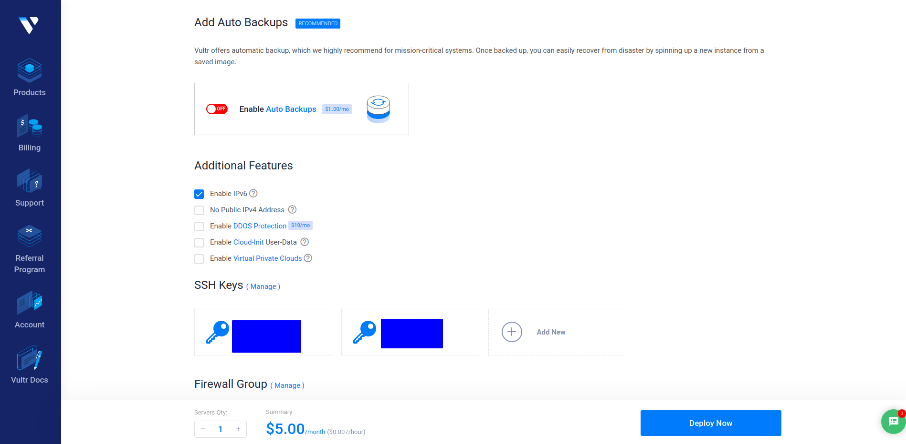

# 上网指南

声明：本文仅为简单服务器搭建、网页制作和流量分发代理的一篇操作感悟，仅供学习、交流目的，请勿用于违法行为。

本文全文参照https://allinfa.com/v2ray-caddy-tls-http2-plus.html 仅在几处我实际使用过程中出现的一些问题做出一些和补充。

本文主要目的分享通过v2ray、caddy、http+tls实现伪装流量隐秘的上网以绕过某些限制更快的访问github等网站。

实现本文描述预计需要3小时左右。


### 事前准备

一台拥有公网ip地址的中国大陆境外的，且能在中国大陆内通过正常方式访问的vps

一个能够在中国大陆境内通过正常方式访问的域名

一台能够使用ssh的电脑

如果暂时没有以上内容，vps租金预计30-40元/月（无优惠情况），域名租金预计6-10元/年。（人民币）

如果已有，一下三章可以跳过。


### vps购买 

请依照个人需求购买，参考网站https://www.10besty.com/best-vps-hosting-services/

以下为我个人的购买经历（vultr）

##### 1.注册账号

通过一些神奇的方法访问[https://www.vultr.com](https://www.vultr.com/?ref=7164730)注册账号


填入账号密码注册即可

##### 2.充值

vultr经常会有活动，但是他的活动有些坑在里边，截止2022年7月9日建议使用充多少送多少的活动，其他的说是会送你多少100美元之类的，但是这100实际上是有一个月时间限制的，超过一个月没用完那也就没了。充多少送多少的话有效期会有12个月。（仅实现上网功能的最低配置的话3.5或5美元/月就够了，配置见下下下图）

登录之后，点开Billing，找一个你能用的支付方式买就行了


因为我已经用过新用户优惠了，你没用的话可能是长这个样子


在画框这个地方输入优惠码**VULTRMATCH**（这个是充多少送多少活动的优惠码，截止2022.7.9还是这个）然后充就行了

##### 3.购买vps

点击Deploy New Server


根据你自己需要选配置，图中的是价格最低的


位置和系统有需求根据自己需求，但是要求是linux的一种，不要用windows的，无其他需求的话可以用Debian

位置离中国大陆越近延迟低，但是你之后用它上网推荐的东西就会根据你选的地址不一样会有些变化。

New York的有一个最便宜三块五美元，但是实际用起来感觉好卡，可能是我用的不太对。



自动备份感觉没什么大用可以关了，ipv6，ssh也看你个人需要，防火墙会设置的话可以自己配一个，不会的话后边会配一个简单的。

选好之后点Deploy Now买就行了。

你买的服务器的账号、密码、ip、地址等详情在下面这张图的页面。

p.s.买完之后先ping一下看看能不能这个ip被墙了没，连不上的话就给这个删了再换一个（换的时候建议先重新买一个然后再删之前的，避免前后给你分同样的ip），如果有看netflix的需求的话后边会给一个测试来试一下你现在的vps能连上不能。（有一些网站比方说netflix为了避免多人公用一个账号，然后给常见服务器的ip段封了，导致你即使翻墙了但还是连不上）

##### 4.netflix测试方法

ssh连上你刚买的服务器，或者点开服务器详情页面，直接打开他提供的远程命令行，只是延迟有点严重。


输入（除非你买的服务器不是x86_64架构的）（虽然大家应该都知道，不管ssh还是用网页自带的远程连接都是可以复制粘贴的，应该没有人会自己打字吧，并且后续要输入的东西很多哒，自己打要累死还容易错）

``` bash
wget -O nf https://github.com/sjlleo/netflix-verify/releases/download/2.52/nf_2.52_linux_amd64 && chmod +x nf && clear && ./nf
```

之后就会运行检测能不能连上，下图两张都是**不能**正常访问时的输出


### 域名购买及配置

***下面的过程建议善用https://mxtoolbox.com 之类的测试网站来检查那个地方配置出错了***

##### 1.域名购买

可以注册并登录NameSilo上买https://www.namesilo.com/login?redirect=/account_domain_manage_nameservers.php 虽然他网站有点复古，但是很便宜，并且配套服务算比较全。单买一个域名就行，ssl之类的后面会自己配。怎么买很好查到就不再写了。

注意：有些域名看起来很便宜比方说.xyz的，六块钱就可以用一年，但是他续费是挺贵的。如果你买个域名就为了这个用的话，一年一换个便宜的就行，但是如果你还想用这个域名搭其他网站长时间用的话建议找个续费便宜一点的。

##### 2.配置

购买完域名后打开域名的配置界面


点开这个小蓝球管理DNS，把原有默认的全删掉，应该是在这一片，但是因为我已经删完了所以我的这没有东西


然后返回，点击这个蓝圈


进入之后先点Unlock，解锁之后再点Change，把原有的删掉。之后先把这个网站放一边不要关了。


之后注册并登录cloudflare，是一个免费托管域名的网站。https://www.cloudflare.com/zh-cn/


点击添加你刚才购买的域名。添加之后点DNS


添加新的，type选A，Name填@表示一级域名（如图），ipv4那填往上数8张图片那里你买的服务器的ip地址，Proxy status必须关掉，否则会给你解析到其他ip上，不符合本教程的需要。ttl选auto。然后添加即可。

之后再设置几个二级域名，（二级域名被封的话可以再设置，一级域名被封的话就只能再买了）如下图


type选CNAME，名字随便写一个都行，target写上图中画圈的地方也就是你买的一级域名，其他设置同上，添加即可。

之后这个页面往下翻


这两行复制，添加到


把change里原有的删了，刚才那两行的添加进去，之后返回lock一下。


此页面如图设置，Edge Certificates如下图


### 服务器设置

#### 1.更新系统、设定时区、校准时间

输入，建议设定时区到香港

``` bash
dpkg-reconfigure tzdata && apt update && apt -y upgrade
```

输入，看一下输出时间和你电脑上的差的多不多，注意时区可能会不一样，只要误差在一分半内就可以，否则后续无法正常使用。

``` bash
date -R
```

如果误差超过一分半输入，引号内改成同样格式的正确时间。没有那么大误差的话跳过此步。

``` bash
sudo date --set="2022-07-09 20:16:23"
```


#### 2.安装一些需要的东西

依次输入

``` bash
apt install curl -y
apt install unzip daemon -y
```


#### 3.编辑系统配置

（大家应该会用vim吧，分界线里边的是写到对应文件里的，其他是命令行的命令）

``` bash
sudo vim /etc/sysctl.conf

#向文件内输入--------------------------分界线------------------------------------

# max open files
fs.file-max = 51200
# max read buffer
net.core.rmem_max = 67108864
# max write buffer
net.core.wmem_max = 67108864
# default read buffer
net.core.rmem_default = 65536
# default write buffer
net.core.wmem_default = 65536
# max processor input queue
net.core.netdev_max_backlog = 4096
# max backlog
net.core.somaxconn = 4096
# resist SYN flood attacks
net.ipv4.tcp_syncookies = 1
# reuse timewait sockets when safe
net.ipv4.tcp_tw_reuse = 1
# turn off fast timewait sockets recycling
net.ipv4.tcp_tw_recycle = 0
# short FIN timeout
net.ipv4.tcp_fin_timeout = 30
# short keepalive time
net.ipv4.tcp_keepalive_time = 1200
# outbound port range
net.ipv4.ip_local_port_range = 10000 65000
# max SYN backlog
net.ipv4.tcp_max_syn_backlog = 4096
# max timewait sockets held by system simultaneously
net.ipv4.tcp_max_tw_buckets = 5000
# TCP receive buffer
net.ipv4.tcp_rmem = 4096 87380 67108864
# TCP write buffer
net.ipv4.tcp_wmem = 4096 65536 67108864
# turn on path MTU discovery
net.ipv4.tcp_mtu_probing = 1
# for high-latency network
net.core.default_qdisc=fq
net.ipv4.tcp_congestion_control = bbr

#保存，退出----------------------------分界线-----------------------------

#命令行输入 激活刚才的修改
sysctl -p

#命令行输入
vim /etc/security/limits.conf

#文件内写入----------------------------------------------
* soft nofile 51200
* hard nofile 51200

#保存，退出----------------------------------------------

#命令行输入
vim /etc/profile

#文件内写入---------------------------------------------------
ulimit -SHn 51200

#保存，退出---------------------------------------------------
```


#### 4.安装配置caddy

``` bash
#命令行依次输入
sudo apt-get install yum

yum -y install wget

wget -P /usr/local/bin "https://daofa.cyou/c1/caddy.tar"

tar -xvf /usr/local/bin/caddy.tar -C /usr/local/bin

rm /usr/local/bin/caddy.tar
```

``` bash
#命令行输入可以确定caddy安装到哪了
whereis caddy
#输出即为caddy的位置
```

赋予caddy权限

``` bash
#命令行依次输入
chown root:root /usr/local/bin/caddy

chmod 755 /usr/local/bin/caddy
```

允许caddy使用80和443端口（80是http用的，443是https的）

``` bash
#命令行输入
apt install libcap2-bin

setcap 'cap_net_bind_service=+ep' /usr/local/bin/caddy
```

创建组合用户

``` bash
#命令行输入
groupadd -g 33 www-data

useradd -g www-data --no-user-group --home-dir /var/www --no-create-home --shell /usr/sbin/nologin --system --uid 33 www-data
```

创建网页配置目录

``` bash
#命令行输入（caddy配置目录）
mkdir /etc/caddy

#命令行输入（网页证书目录）
mkdir /etc/ssl/caddy

#命令行输入（创建日志输出文件）
touch /var/log/caddy.log


#命令行输入（赋予读写权限）
chown -R root:root /etc/caddy

chown -R root:www-data /etc/ssl/caddy

chmod 770 /etc/ssl/caddy

chown root:www-data /var/log/caddy.log

chmod 770 /var/log/caddy.log
```

创建一个网站（简易版）

``` bash
#命令行输入
mkdir -p /var/www/html

chown -R www-data:www-data /var/www

touch /etc/caddy/Caddyfile

touch /var/www/html/index.html

vim /var/www/html/index.html

#向文件内写入---------------------------------------------------------------
<!DOCTYPE html>
<html>
	<head>
		<title>我的网站</title>
	</head>
	<body>
		<h1 style="font-family: sans-serif"> 这里是标题 </h1>
		这里是网站网页正文
	</body>
</html>

#保存，退出-----------------------------------------------------------------

#想弄个复杂点的网站建议在你电脑上做好之后用sftp传到服务器/var/www/html文件夹下
```

``` bash
#设置SystemD来方便管理

#命令行输入
touch /etc/systemd/system/caddy.service

vim /etc/systemd/system/caddy.service

#文件内输入-----------------------------------------------
[Unit]
Description=Caddy HTTP/2 web server
Documentation=https://caddyserver.com/docs
After=network-online.target
Wants=network-online.target systemd-networkd-wait-online.service

; Do not allow the process to be restarted in a tight loop. If the
; process fails to start, something critical needs to be fixed.
StartLimitIntervalSec=14400
StartLimitBurst=10

[Service]
Restart=on-abnormal

; User and group the process will run as.
User=www-data
Group=www-data

; Letsencrypt-issued certificates will be written to this directory.
Environment=CADDYPATH=/etc/ssl/caddy

; Always set "-root" to something safe in case it gets forgotten in the Caddyfile.
ExecStart=/usr/local/bin/caddy -log stdout -log-timestamps=false -agree=true -conf=/etc/caddy/Caddyfile -root=/var/tmp
ExecReload=/bin/kill -USR1 $MAINPID

; Use graceful shutdown with a reasonable timeout
KillMode=mixed
KillSignal=SIGQUIT
TimeoutStopSec=5s

; Limit the number of file descriptors; see `man systemd.exec` for more limit settings.
LimitNOFILE=1048576
; Unmodified caddy is not expected to use more than that.
LimitNPROC=512

; Use private /tmp and /var/tmp, which are discarded after caddy stops.
PrivateTmp=true
; Use a minimal /dev (May bring additional security if switched to 'true', but it may not work on Raspberry Pi's or other devices, so it has been disabled in this dist.)
PrivateDevices=false
; Hide /home, /root, and /run/user. Nobody will steal your SSH-keys.
ProtectHome=true
; Make /usr, /boot, /etc and possibly some more folders read-only.
ProtectSystem=full
; … except /etc/ssl/caddy, because we want Letsencrypt-certificates there.
;   This merely retains r/w access rights, it does not add any new. Must still be writable on the host!
ReadWritePaths=/etc/ssl/caddy
ReadWriteDirectories=/etc/ssl/caddy

; The following additional security directives only work with systemd v229 or later.
; They further restrict privileges that can be gained by caddy. Uncomment if you like.
; Note that you may have to add capabilities required by any plugins in use.
;CapabilityBoundingSet=CAP_NET_BIND_SERVICE
;AmbientCapabilities=CAP_NET_BIND_SERVICE
;NoNewPrivileges=true

[Install]
WantedBy=multi-user.target

#保存，退出-----------------------------------------------

#命令行输入
chown root:root /etc/systemd/system/caddy.service

chmod 644 /etc/systemd/system/caddy.service

systemctl daemon-reload
```


#### 5.安装配置v2ray

``` bash
#命令行输入（安装）
curl -O https://raw.githubusercontent.com/v2fly/fhs-install-v2ray/master/install-release.sh

curl -O https://raw.githubusercontent.com/v2fly/fhs-install-v2ray/master/install-dat-release.sh

bash install-release.sh
```

下面几个有注释的地方会有@1 - @4，后面会用@ + 数字来代指这个地方的内容

``` bash
#命令行输入（配置）
cp /usr/local/etc/v2ray/config.json /usr/local/etc/v2ray/config.json.last #备份以下免得配置坏了还改不回来

#命令行输入
rm /usr/local/etc/v2ray/config.json && vim /usr/local/etc/v2ray/config.json

#注意：注释地方是要改的！！！！！
#文件内写入-------------------------------------
{
  "log": {
    "loglevel": "warning",
    "error": "/var/log/v2ray/error.log",
    "access": "/var/log/v2ray/access.log"
  },
  "dns": {},
  "stats": {},
  "inbounds": [
    {
      "settings": {
        "clients": [
          {
            "alterId": 0,			# @1理论上来说这个设置多少都行，但实际上我的只有写0才能用
            "id": "a1199f80-a920-437b-9531-7f86b62533a0"	# @2这一串id可以自己设置，只要格式对，但是要记下来，之后还有用
          }
        ]
      },
      "port": 33888,	# @3端口也可以自己设置，但是不要写
      "tag": "in-0",
      "streamSettings": {
        "security": "tls",
        "httpSettings": {
          "path": "/vv22",	# @4路径也可以自己随便写一个，但是也要记下来有用
          "host": [
            "你的域名"	#你在域名配置中配置的二级域名
          ]
        },
        "tlsSettings": {
          "certificates": [
            {
              "certificateFile": "/usr/local/etc/v2ray/v2ray.cer",	#根据你实际申请的证书可能会有变动，但是应该不用改
              "keyFile": "/usr/local/etc/v2ray/v2ray.key"	#根据你实际申请的证书可能会有变动，但是应该不用改
            }
          ]
        },
        "network": "h2"
      },
      "protocol": "vmess",
      "listen": "127.0.0.1"
    }
  ],
  "outbounds": [
    {
      "tag": "direct",
      "protocol": "freedom",
      "settings": {}
    },
    {
      "tag": "blocked",
      "protocol": "blackhole",
      "settings": {}
    }
  ],
  "routing": {
    "domainStrategy": "AsIs",
    "rules": [
      {
        "outboundTag": "blocked",
        "ip": [
          "geoip:private"
        ],
        "type": "field"
      }
    ]
  },
  "policy": {},
  "reverse": {},
  "transport": {}
}


#保存，退出-------------------------------------
```


#### 6.配置caddy（上边的第4步其实没配置完）

``` bash
#命令行输入
vim /etc/caddy/Caddyfile

#注意 下面有需要根据你的情况修改的地方！！！！
#文件内输入----------------------------------------

http://你的域名 {						#改为你的域名
    redir https://你的域名{url}			#改为你的域名
}		#重定向，防止进错

https://h2.abcdef.com {
	gzip
    tls /usr/local/etc/v2ray/v2ray.cer /usr/local/etc/v2ray/v2ray.key
    log /var/log/caddy.log
    root /var/www/html
    proxy /@4 https://localhost:@3 {         #此处的路径和端口改为上边的@3和@4
    insecure_skip_verify
    header_upstream X-Forwarded-Proto "https"
    header_upstream Host "你的域名"				#改为你的域名
  }
  header / {
    Strict-Transport-Security "max-age=31536000;"
    X-XSS-Protection "1; mode=block"
    X-Content-Type-Options "nosniff"
    X-Frame-Options "DENY"
  }
}

#保存，退出----------------------------------------

#命令行输入
chown root:root /etc/caddy/Caddyfile

chmod 644 /etc/caddy/Caddyfile
```

**为网站申请证书**

打开网站https://dash.cloudflare.com/profile/api-tokens


查看Global API Key然后复制下来

``` bash
#命令行输入
apt install socat

curl  https://get.acme.sh | sh

source ~/.bashrc

export CF_Key="刚才复制的"

export CF_Email="注册cloudflare账号用的邮箱"

acme.sh --register-account -m 你的邮箱

acme.sh --issue --dns dns_cf -d 你的域名 --keylength ec-256

acme.sh --installcert -d 你的域名 --ecc --key-file /usr/local/etc/v2ray/v2ray.key --fullchain-file /usr/local/etc/v2ray/v2ray.cer --force

#赋予读写权限
chown root:root /usr/local/etc/v2ray/v2ray.cer
chown root:root /usr/local/etc/v2ray/v2ray.key
chmod 644 /usr/local/etc/v2ray/v2ray.cer
chmod 644 /usr/local/etc/v2ray/v2ray.key
```

### 启动

#### 1.启动caddy

``` bash
#命令行输入
systemctl daemon-reload

systemctl start caddy

systemctl status caddy	#检查caddy启动成功没，如果有一个绿色的active就是成功了

systemctl enable caddy	#设置caddy开机自启动

#如果caddy启动失败的话，按以下命令查看caddy日志来看看是哪错了（可能是有什么包没安装之类的），没出错就忽略下边这两步
caddy -agree -conf /etc/caddy/Caddyfile 

journalctl --boot -u caddy.service
```

#### 2.启动v2ray

``` bash
#命令行输入
systemctl daemon-reload

systemctl start v2ray

#检查v2ray是否正常运行
systemctl status v2ray

#如果没有正常运行，检查v2ray日志
journalctl -u v2ray
```


### 防火墙

``` bash
#命令行输入
apt install ufw

ufw default deny incoming

ufw default allow outgoing

#允许端口
ufw allow 22

ufw allow 2222

ufw allow 80

ufw allow 443

#启用防火墙
ufw enable
```


### 客户端推荐

#### 1.windows

**v2rayN** 

下载：github https://github.com/2dust/v2rayN

#### 2.安卓

**SagerNet**

下载：github https://github.com/SagerNet/SagerNet

#### 3.ios

**Shadowroctet**

下载：只要不是国内苹果账号就能在app store搜到，很好用但是付费（30左右买断）。

#### 4.linux

Qv2ray

下载：github https://github.com/Qv2ray/Qv2ray

#### 5.macos

没用过不知道

#### 6.客户端配置

大同小异如图


### 附录

``` bash
#目录表（以下目录是默认配置的话应该会在这个地方，如果不对的话用whereis找找）

#caddy程序目录	
/usr/local/bin/caddy

#caddy配置文件	
/etc/caddy/Caddyfile

#网页文件目录	
/var/www/html

#网页证书文件	
/usr/local/etc/v2ray/v2ray.cer /usr/local/etc/v2ray/v2ray.key

#v2ray程序目录	
/usr/local/bin/v2ray

#v2ray配置目录	
/usr/local/etc/v2ray/config.json

#v2ray辅助工具目录	  
/usr/local/bin/v2ctl

#v2ray路由设置的ip和域名数据	  
/usr/local/share/v2ray/geoip.dat	  /usr/local/share/v2ray/geosite.dat
```

``` bash
#命令表

#更新v2ray
bash install-dat-release.sh

#更新v2ray路由文件
bash install-dat-release.sh

#停止v2ray
systemctl stop v2ray

#重载v2ray配置
systemctl daemon-reload

#重启v2ray
systemctl restart v2ray

#查看v2ray状态
systemctl status v2ray

#删除v2ray（如果你不想用了的话）
bash install-release.sh --remove

#重载caddy配置文件
systemctl daemon-reload

#重启caddy
caddy -service restart

#查看caddy启动成功没有
systemctl status caddy

#查看caddy日志
caddy -agree -conf /etc/caddy/Caddyfile 
journalctl --boot -u caddy.service

#卸载caddy（如果你不想用了的话）
caddy -service uninstall

#更新网页证书（应该是会自动更新的）
acme.sh --installcert -d 你的域名 --ecc --key-file /usr/local/etc/v2ray/v2ray.key --fullchain-file /usr/local/etc/v2ray/v2ray.cer --force
```
